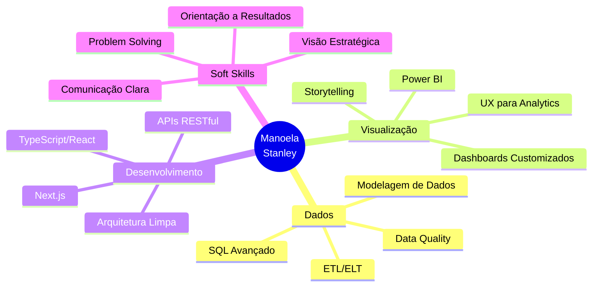

<div align="center">

<!-- Banner Animado -->


<!-- Avatar -->
<a href="https://github.com/zatstanley">
  
</a>

<p>
  
</p>

</div>

---

## 👩‍💻 Sobre Mim

```typescript
const manoela: Developer = {
  nome: "Manoela Stanley",
  localização: "Brasil 🇧🇷",
  área: "Data Engineering & Full Stack Development",
  
  especialidades: [
    "Análise e Engenharia de Dados",
    "Visualização de Dados & Dashboards",
    "Desenvolvimento Full Stack",
    "Arquitetura de Soluções Data-Driven"
  ],
  
  missão: `Criar soluções onde dados não são apenas suporte, 
           mas o centro da tomada de decisão estratégica`,
  
  abordagem: {
    dados: "Organizar, analisar e apresentar informações de forma clara",
    desenvolvimento: "Unir análise, engenharia e experiência do usuário",
    entrega: "Soluções bem estruturadas, sustentáveis e escaláveis"
  },
  
  valores: ["Clareza", "Precisão", "Usabilidade", "Impacto"]
};
```

---

<div align="center">

## 🛠️ Stack Tecnológica

### **Data Engineering & Analytics**


### **Frontend Development**


### **Backend & APIs**


### **Ferramentas & DevOps**


### **Visualização de Dados**


</div>

---

<div align="center">

## 📊 GitHub Analytics

<p>
  
  
</p>

<!-- Streak Stats -->
<p>
  
</p>

<!-- Activity Graph -->


</div>

---

## 💼 Áreas de Atuação

<table>
  <tr>
    <td width="33%" align="center">
      
      <h3>📊 Data Engineering</h3>
      <p align="left">
        • Modelagem de dados relacionais<br>
        • SQL avançado e otimização de queries<br>
        • ETL/ELT pipelines<br>
        • Integração de múltiplas fontes de dados
      </p>
    </td>
    <td width="33%" align="center">
      
      <h3>📈 Data Visualization</h3>
      <p align="left">
        • Dashboards em Power BI<br>
        • Visualizações customizadas com React<br>
        • Storytelling com dados<br>
        • UX/UI para analytics
      </p>
    </td>
    <td width="33%" align="center">
      
      <h3>💻 Full Stack Development</h3>
      <p align="left">
        • Aplicações data-driven com React/Next.js<br>
        • APIs RESTful e integração de dados<br>
        • TypeScript para type-safety<br>
        • Arquitetura escalável e sustentável
      </p>
    </td>
  </tr>
</table>

---

## 🎯 Projetos em Destaque

<div align="center">

<table>
  <tr>
    <td width="50%">
      <h3 align="center">📊 Dashboard Analytics</h3>
      <div align="center">  
        <a href="https://github.com/zatstanley/dashboard-project" target="_blank">
          
        </a>
        <p>
          
          
          
        </p>
        <p><strong>Dashboard interativo com visualizações customizadas e integração com múltiplas fontes de dados</strong></p>
      </div>
    </td>
    <td width="50%">
      <h3 align="center">🗄️ Data Pipeline</h3>
      <div align="center">  
        <a href="https://github.com/zatstanley/data-pipeline" target="_blank">
          
        </a>
        <p>
          
          
          
        </p>
        <p><strong>Pipeline automatizado de ETL com validação de dados e transformações complexas</strong></p>
      </div>
    </td>
  </tr>
</table>

</div>

---

## 🌟 Diferenciais

<div align="center">



</div>

---

## 📚 Aprendizado Contínuo

<div align="center">

```typescript
const currentFocus = {
  learning: [
    "Advanced Data Engineering Patterns",
    "Real-time Data Processing",
    "Machine Learning Integration",
    "Advanced TypeScript Patterns",
    "Data Mesh Architecture"
  ],
  
  reading: [
    "Designing Data-Intensive Applications",
    "The Data Warehouse Toolkit",
    "Clean Architecture"
  ],
  
  nextGoals: [
    "Certificação AWS Data Analytics",
    "Contribuir em projetos Open Source de Data Viz",
    "Publicar artigos técnicos sobre Data + Frontend"
  ]
};
```

</div>

---

## 🐍 Contribuições

<div align="center">


</div>

---

## 💡 Filosofia de Trabalho

<div align="center">

### "Dados sem clareza não geram decisões. Tecnologia sem propósito não gera valor."

<br>

<table>
  <tr>
    <td align="center" width="25%">
      <br>
      <strong>Precisão</strong><br>
      <sub>Dados confiáveis e bem estruturados</sub>
    </td>
    <td align="center" width="25%">
      <br>
      <strong>Clareza</strong><br>
      <sub>Informações acessíveis e compreensíveis</sub>
    </td>
    <td align="center" width="25%">
      <br>
      <strong>Impacto</strong><br>
      <sub>Soluções que geram resultados reais</sub>
    </td>
    <td align="center" width="25%">
      <br>
      <strong>Sustentabilidade</strong><br>
      <sub>Código limpo e escalável</sub>
    </td>
  </tr>
</table>

</div>

---

## 📈 Estatísticas Detalhadas

<div align="center">

<details>
<summary><b>⚡ Métricas de Produtividade</b></summary>
<br/>

<!--START_SECTION:waka-->
<!--END_SECTION:waka-->

</details>

<details>
<summary><b>🏆 Conquistas GitHub</b></summary>
<br/>

<p>
  
</p>

</details>

</div>

---

## 🌐 Vamos Conectar?

<div align="center">

<p>
  <a href="https://linkedin.com/in/zatstanley">
    
  </a>
  <a href="mailto:manoela.stanley@email.com">
    
  </a>
  <a href="https://github.com/zatstanley">
    
  </a>
  <a href="https://twitter.com/zatstanley">
    
  </a>
</p>

### 💬 Aberta para colaborações em projetos que:

- 📊 Utilizem dados como base para decisões estratégicas
- 🎨 Priorizem experiência do usuário e visualização eficaz
- 🏗️ Busquem arquitetura sólida e sustentável
- 🚀 Tenham impacto real no negócio ou comunidade

</div>

---

<div align="center">

## 📊 Estatísticas de Visitantes


<br><br>


</div>

---

<div align="center">


---

<p>
  
</p>

**⭐ Se você gostou do meu trabalho, deixe uma estrela nos repositórios! ⭐**

</div>
